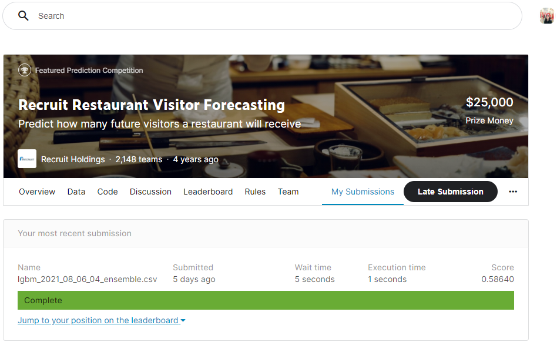

# kaggle Competition - recruit restaurant visitor forecasting
Link to the Kaggle competition: https://www.kaggle.com/c/recruit-restaurant-visitor-forecasting/data
## Background Story

1. Restaurants need to know how many customers to expect each day to effectively purchase ingredients and schedule staff members.   
2. This forecast isn't easy to make because many unpredictable factors affect restaurant attendance, like weather and local competition. It's even harder for newer restaurants with little historical data.

## About the Dataset

1. 8 files of relational data is provided from two separate Japanes websites: "Hot Pepper Gourmet (hpg)" similar to Yelp and "AirREGI/Restairamt Board (air)" similar to Square, based on the time range of Jan 2016 - most of Apr 2017
2. This restaurant data is from Japanese restaurants: we need to consider Japan's holdiay week called the "Golden Week".

## Goal

Use reservation and visitation data to predict the total number of visitors to a restaurant for future dates. (-> This is a Time Series Forecasting problem)

## Evaluation

RMSLE (root mean squared logarithmic error)

## Submission

For every store and date combination in the test set, submission files should contain two columns: `id` and `visitors`.
   
# Feature Engineering Overview 
(including data load + preprocessing)
1. Apply the concept of '**resampling**' and '**rolling features**'
2. Handle Holidays & Weekend spike
3. Merge Train & Test (Submission) dataset by adding a column `is_test`
4. Merged `Air_store data, Air_visit data, date_info, and preprocessed weather data`
5. Grouping **genre-wise** and **area-wise** restaurants
6. Take care of **weekdays** and **day of month**
7. Tried multiple ways to create Validation set
8. Handle Categorical variables by trying **one-hot encoding** & **label encoding**
9. Visualize **Feature Importance**
10. Tried Feature Selection with **RFE (Recursive Feature Elimination)**

11. Handled outliers with taking log_1p
12. Optimization with **EWM (Exponential Weighted Average)**
13. Compute additional features with **mean, mediam, standard deviation, min, max**

# Model Overview
1. Train & Validation   
**KFold** validation on a **rolling basis** (because this is a *time series* data, we can forecast for the later data points and then checking the accuracy for the forecasted data points. The same forecasted data points are then included as part of the next training dataset and subsequent data points are forecasted.)
2. Train Model   
    - `LGBMRegressor`
    - Ensemble with `GradientBoostingRegressor, KNeighborRegressor, XGBRegressor`   

# Result
0.58640   

# References

Kernels
- Max HalFold: https://github.com/MaxHalford/kaggle-recruit-restaurant/blob/master/Solution.ipynb
- Got an idea of ensemble models: https://www.kaggle.com/tunguz/surprise-me-2
- Got an idea merging data with the mean values: https://www.kaggle.com/dongxu027/mean-mix-math-geo-harmonic-lb-0-493
- Got an insight of **Feature Engineering**: https://github.com/ligz08/Kaggle-Recruit-Restaurant-Visitor-Forecasting/blob/master/Feature_Engineering.ipynb 

Disucssion
- Externel weather dataset: https://www.kaggle.com/huntermcgushion/rrv-weather-data
- Q: How do you deal with outlier? A: Assuming that the number of visitors as a random variable with a normal distribution: https://www.kaggle.com/c/recruit-restaurant-visitor-forecasting/discussion/46939

Articles
- EWM: https://stackoverflow.com/questions/64575336/ewm-in-pandas-for-timeseries-transformation 
- Ideas of possible approaches: https://medium.com/analytics-vidhya/recruit-restaurant-visitor-forecasting-f9ef87ba1073